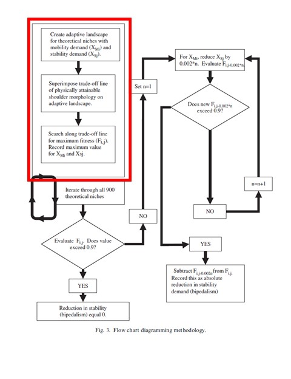
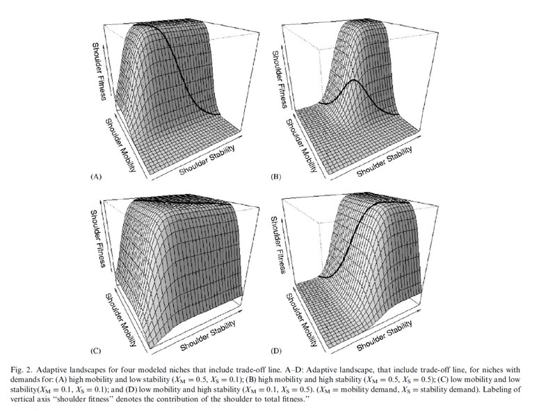
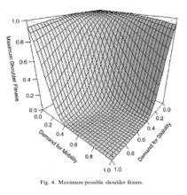

```{r setup, include=FALSE}
knitr::opts_chunk$set(
	echo = TRUE,
	warning = TRUE,
	message = TRUE,
	comment = "##",
	prompt = FALSE,
	tidy = TRUE,
	tidy.opts = list(blank = FALSE, width.cutoff = 75),
	fig.path = "img/",
	fig.align = "center"
)
```
#Data Replication of *Locomotor decoupling and the origin of hominin bipedalism* (Sylvester, 2006)

##Intoduction
Sylvester (2006) developed the decoupling hypothesis for the evolution of bipedalism which states that bipedalism is
an adaptation that allows the shoulder to remain mobile for suspensory locomotion while faced with the need for joint
stability for terrestrial locomotion. This paper explored the possible increase in fitness resulting from the
relaxation of the selective pressures for shoulder stability, which would have accompanied the adaptation of bipedalism.
This was done through phenotypic adaptive landscape modeling. An adaptive landscape is a 2D surface where each
dimension represents the possible character values of a particular continuous trait. For the most part, results were
visually interpreted from the models in this paper.

There were 4 main steps in the methods for this paper. The first was to model 900 theoretical niches with stability
as the x-axis, mobility on the y-axis, and fitness on the z-axis. These adaptive landscapes were created as bivariate
cumulative normal distributions using the pmvnorm function. The second step was to calculate the trade-off line for
each landscape using a hyperbolic model (y ∝1/x) and superimpose it upon each the landscape. The trade-off line
represents the physically attainable shoulder morphologies. The third step was to find the maximum shoulder
fitness for each niche along the trade-off line using the optimize procedure (aka golden search algorithm). The
fourth step was to explore the reduction of the demand for stability and the proportion of quadrupedalism that would
have to be replaced with bipedalism to raise the fitness to above a threshold of 0.9. Here, I replicate portions of
the first 3 steps: the simulation of 4 of 900 niches, superimpose the trade-off lines for those for landscapes and
use the golden search algorithm to search for the maximum shoulder fitness, plotting that against the demands for mobility and stability.

#A note
There is no .csv file for this paper because the data are simulated/theoretical and there are no basic descriptive
statistics because those are the paramaters from which the models were built off of.


##Replications

The red box in the figure below indicates the portion of the simulation that I replicated.



###Modeling 4 of the 900 theorectical niches and their trade-off lines

I modeled the 4 niches that were given as examples in the paper. Modelling requires 5 parameters as stated in
Sylvester (2006). The first 2 are the means of mobility and stability in each population. These range from 0 - 1 in
intervals of 0.033. 0 is the least mobile or stable and 1 is the most mobile or stable. The 3rd and 4th parameters
are the 2 variances for mobility and stablity both were set at 0.01 (the higher the variance the flatter the
landscape because there becomes less of a difference in fitness level so variances were kept at a low value).
Covariance was the last parameter and it was set at 0. The following four models have the same code but different mean values.

These are the adaptive landscape examples from Figure 2 in Sylvester (2006).


###Model for high mobility and high stability (mean mobility = 0.5, mean stability = 0.5)

```{r}
library(mvtnorm) #pmvnorm which is said to be the function used Sylvester 2006 is in the package mvtnorm. 
#There are more sophistocated adpative landscape packages now but this suites the needs for this simulation

library(grDevices)#for trans3d function

library(graphics)

mean1 <-c(.5,.5)#the argument is to be used as the mean vector in the both pmvnorm functions below
x <- seq(0, 1, length= 30)#this makes the intervals 0.033 for the shoulder stability in populations
y <- seq(0, 1, length= 30)#this makes the intervals 0.033 for the shoulder mobility in populations
z<-matrix(rep(0,30*30),nc=30)#this constructs a 30 by 30 (nc = 30) matrix of fitness values and fills it with zeros
  for(i in 1:30){
    for(j in 1:30){#these 2 loops allow the below bivariate cumulative normal distribution function to go through all of the values for x & y
      R<-matrix(c(.01,0,0,.01),nc=2)#this constructs the matrix of variances and covariance which is for sigma below
      z[i,j]<-pmvnorm(lower=rep(-Inf,2),upper=c(x[i],y[j]),mean=mean1,sigma=R)
      #rep() function makes the vector of lower limits -inf for both, the vectors of upper limits are equal to the sequences created for x & y. Fitness values are added to the z matrix every time it loops through.
}
  }
    #the below lines are for the visualization of the adaptive landscapes
  
op <- par(bg = "white")#sets the background to white
  pmat <- persp(x,y,z, theta = -45, phi=30, col="seagreen1", xlab = "Shoulder Stability", ylab = "Shoulder Mobility", zlab = "Shoulder Fitness", shade=.1) 
  #this uses the persp function to make the 3d plots (theta and phi define viewing angles)
  
  
  #the below is for plotting the trade-off line
  x2 <- seq(.3, 1, length = 30)#vector of x values on trade-off line
  y2 <- .3/(x2)#vector of y values on trade-off line
  z2 <- 0 #this will because the vector of z values for the line
  for(i in 1:30){
    z2[i] <- pmvnorm(lower=rep(-Inf,2),upper=c(x2[i],y2[i]),mean=mean1,sigma=R)
  }#calculates the z values for the trade-off line
  #below transforms vectors to 2d points of the trade-off line
  lines(trans3d(x2,y2,z2, pmat=pmat), col="blue", lwd=3)
  trans3d <- function(x,y,z, pmat) {
    tr <- cbind(x,y,z,1) %*% pmat 
    list(x = tr[,1]/tr[,4], y= tr[,2]/tr[,4])
    
  }
  

```


###Model for high mobility and low stability (mean mobility = 0.5, mean stability = 0.1)

```{r}
mean2 = c(.5,.1)
for(i in 1:30){
    for(j in 1:30){#these 2 loops allow the below bivariate cumulative normal distribution function to go through all of the means for x & y
      R<-matrix(c(.01,0,0,.01),nc=2)#this constructs the matrix of variances and covariance which is for sigma below
      z[i,j]<-pmvnorm(lower=rep(-Inf,2),upper=c(x[i],y[j]),mean=mean2,sigma=R)
      #rep() function make the vector of lower limits -inf for both, the vectors of upper limits are equal to the sequences of means created for x & y, mean draws from the main argument from the overall adaptive lanscape function
}
  }
    #the below lines are for the visualization of the adaptive landscapes
  op <- par(bg = "white")#sets the backgrounds to be white
  pmat <- persp(x,y,z, theta = -45, phi=30, col="thistle1", xlab = "Shoulder Stability", ylab = "Shoulder Mobility", zlab = "Shoulder Fitness", shade=.5)#this uses the persp function to make the 3d plots. theta and phi define viewing angles.
  
  
  #where trade-off line calculating and plotting begins again
  x2 <- seq(.3, 1, length = 30)
  y2 <- .3/(x2)
  z2<-0
  for(i in 1:30){
  z2[i] <- pmvnorm(lower=rep(-Inf,2),upper=c(x2[i],y2[i]),mean=mean2,sigma=R)
}
  lines(trans3d(x2,y2,z2, pmat=pmat), col="red", lwd=3)
  trans3d <- function(x,y,z, pmat) {
  tr <- cbind(x,y,z,1) %*% pmat
  list(x = tr[,1]/tr[,4], y= tr[,2]/tr[,4])
}


```


###Model for low mobility and low stability(mean mobility = 0.1, mean stability = 0.1)
```{r}
mean3 = c(.1,.1)
for(i in 1:30){
    for(j in 1:30){#these 2 loops allow the below bivariate cumulative normal distribution function to go through all of the means for x & y
      R<-matrix(c(.01,0,0,.01),nc=2)#this constructs the matrix of variances and covariance which is for sigma below
      z[i,j]<-pmvnorm(lower=rep(-Inf,2),upper=c(x[i],y[j]),mean=mean3,sigma=R)
      #rep() function make the vector of lower limits -inf for both, the vectors of upper limits are equal to the sequences of means created for x & y, mean draws from the main argument from the overall adaptive lanscape function
}
  }
    #the below lines are for the visualization of the adaptive landscapes
  op <- par(bg = "white")#sets the backgrounds to be white
  pmat <- persp(x,y,z, theta = -45, phi=30, col="blue", xlab = "Shoulder Stability", ylab = "Shoulder Mobility", zlab = "Shoulder Fitness", shade=.5) #this uses the persp function to make the 3d plots. theta and phi define viewing angles.
  
  
  #Trade-off line
  x2 <- seq(.3, 1, length = 30)
  y2 <- .3/(x2)
  z2<-0
  for(i in 1:30){
  z2[i] <- pmvnorm(lower=rep(-Inf,2),upper=c(x2[i],y2[i]),mean=mean3,sigma=R)
}
  lines(trans3d(x2,y2,z2, pmat=pmat), col="green", lwd=3)
  trans3d <- function(x,y,z, pmat) {
  tr <- cbind(x,y,z,1) %*% pmat
  list(x = tr[,1]/tr[,4], y= tr[,2]/tr[,4])
}
```


###Model for low mobility and high stability (mean mobility = 0.1, mean stability = 0.5)
```{r}
mean4 = c(.1,.5)
for(i in 1:30){
    for(j in 1:30){#these 2 loops allow the below bivariate cumulative normal distribution function to go through all of the means for x & y
      R<-matrix(c(.01,0,0,.01),nc=2)#this constructs the matrix of variances and covariance which is for sigma below
      z[i,j]<-pmvnorm(lower=rep(-Inf,2),upper=c(x[i],y[j]),mean=mean4,sigma=R)
      #rep() function make the vector of lower limits -inf for both, the vectors of upper limits are equal to the sequences of means created for x & y, mean draws from the main argument from the overall adaptive lanscape function
}
  }
    #the below lines are for the visualization of the adaptive landscapes
  op <- par(bg = "white")#sets the backgrounds to be white
  pmat <- persp(x,y,z, theta = -45, phi=30, col="green", xlab = "Shoulder Stability", ylab = "Shoulder Mobility", zlab = "Shoulder Fitness", shade=.5) #this uses the persp function to make the 3d plots. theta and phi define viewing angles.
  
  
  #Trade-off Line
   x2 <- seq(.3, 1, length = 30)
  y2 <- .3/(x2)
  z2<-0
  for(i in 1:30){
  z2[i] <- pmvnorm(lower=rep(-Inf,2),upper=c(x2[i],y2[i]),mean=mean4,sigma=R)
}
  lines(trans3d(x2,y2,z2, pmat=pmat), col="yellow", lwd=3)
  trans3d <- function(x,y,z, pmat) {
  tr <- cbind(x,y,z,1) %*% pmat
  list(x = tr[,1]/tr[,4], y= tr[,2]/tr[,4])
}
```
##Determining Maximum Fitness

This step of the analysis uses the optimize function in the {stats} package which searches an interval of values for
the maximum based on another function which in this case is another bivariate cumulative normal distribution created
using the pmvnorm function. Then I plot the max shoulder fitness of the 900 simulations against the demand for
stability and mobility.


```{r} 
library (stats)

x <- seq(0, 1, length= 30)#same increments as above for stability
y <- seq(0, 1, length= 30)#same increments as above for mobility
z<-0 # starts fitness off at 0 
g<-matrix(rep(0,900),nc=30)#builds matrix of 0s where the max shoulder fitness will be filled in (these end up being on the z axis on the plot below)
for(i in 1:30){#so that each x value will be looped through for the mean in the pmvnorm function below
 for(j in i:30){#so that each time it only loops through the portion of y means equal to and above the x mean
 R<-matrix(c(.01,0,0,.01),nc=2)#same variance and covariance matrix as above
 
 z <- function(p) #have to define a function for the optimize function to work off of. Again, the pmvnorm function is used
   {pmvnorm(lower=rep(-Inf,2),upper=c(p,.3/p),mean=c(x[i],y[j]),sigma=R)}# similar to the above pmvnorm arguments but the x and y values here go directly into the means rather that being part of the  upper limit vector. The upper limit vector is instead determined by input value for the broader function
 sto<-optimize(z, c(0,1), maximum=TRUE) # uses the function above, the range of means, and the instuction to look for max not min to begin its search
 sto<-sto$objective[1]#this pulls out the value to be added to the maxtrix from the output of the optimize function

 sto -> g[i,j]#these two lines add the max fitness values to the g matrix for the associated x & y values
 sto -> g[j,i]

 }
}
#below plots the maximum possible shoulder fitness as in Fig. 4 of Sylvester 
op <- par(bg = "white") #makes the background white
pmat <- persp(x,y,g, theta = 120, phi=20, col="yellow", xlab = "Demand for Stability", ylab = "Demand for Mobility", zlab = "Maximum Shoulder Fitness", shade=.3) #uses the pre-defined x & y values with the calculate max fitness values from matrix g


```



##Summary
Here I reproduced the first 3 steps of the simulations performed to test the decoupling hypothesis. The 4 adaptive landscape examples I produced represent both the means of stability and mobility being high and low, as well as, each being high relative to the other. The optimize function allowed me to identify the maximum shoulder fitness in each of the 900 niches (matrix g) and plot those against the demand for both mobility and stability. The results of the study itself suggest that the reduction in the demand for stability for terrestrial locomotion in the shoulder would have allowed the shoulder to remain mobile for suspensory locomotion. Sylvester suggests that this would have been critical and advantageous in order to not compromise arboreal safety but allow for terrestrial locomotion with the hindlimbs. The results also showed that the absolute and proportional amount of bipedalism (reduction in the demand for stability) that is neccessary to reach a relatively high fitness level because of the shoulder's ability to remain mobile.


##Reference
Sylvester, A. D. (2006). Locomotor decoupling and the origin of hominin bipedalism. Journal of theoretical biology, 242(3), 581-590.